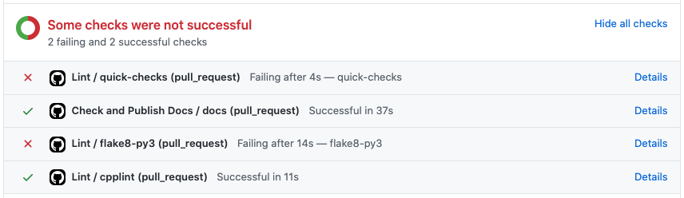
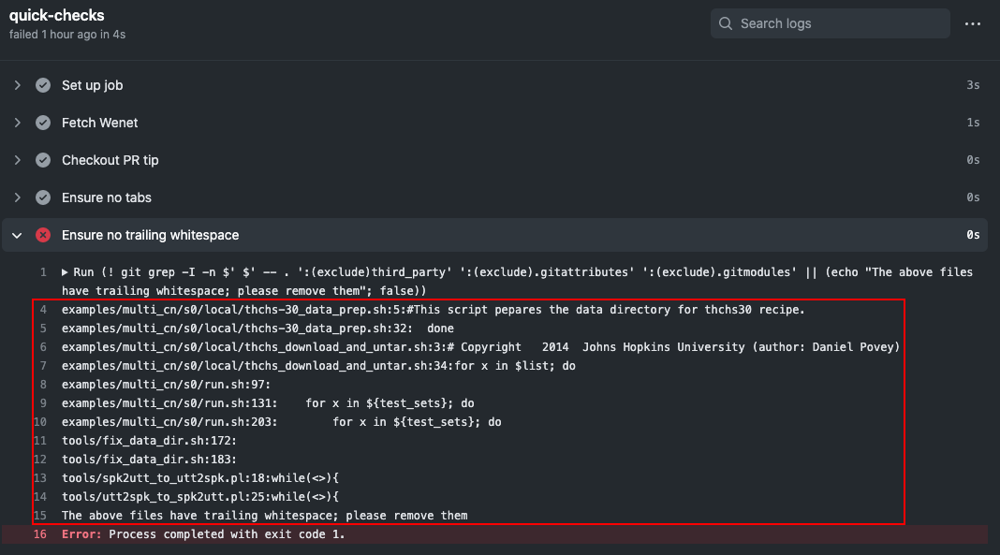

# Contributing guidelines

## Pre-commit tidy/linting hook

You'll need to install flake8 first.

`pip install flake8==3.8.2`

We use flake8 to perform additional formatting and semantic checking of code.
We provide a pre-commit git hook for performing these checks, before a commit
is created:

```bash
ln -s ../../tools/git-pre-commit .git/hooks/pre-commit
```

You have to execute above command in wenet project root directory.
After that, each commit will be checked by flake8.

If you do not set pre-commit, just run `flake8` in wenet project root directory
and fix all the problems.

## Github checks

After a pull request is submitted, some checks will run to check your code style.

Below is an example where some checks fail.



You need to click the details to see the detailed info like the example below.



You have to fix all style problems according to the detailed info.

