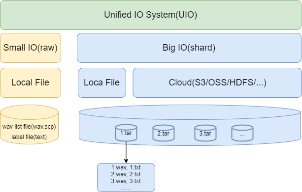

# UIO for WeNet

In order to support the model training of industrial tens of millions of hours of speech dataset, the data processing
method UIO (Unified IO) has been updated in WeNet. The document will introduce UIO from the following sections:
Necessity of upgrading IO mothod, System design of UIO, Validation experiments, Usage of UIO, Q&A.

## Necessity of upgrading IO mothod
The old IO method in WeNet is based on Pytorch's native Dataset. During training, it need to load all training audio
paths and correspondingly labels into the memory at one time, then randomly read data. In the case of industrial-grade
ultra-large-scale data (egs: more than 50,000 hours or 50 million or more audio), this method will cause the training
to fail to run for two reasons:
- Out of memory(OOM): The physical memory of the general machine is difficult to load the training data at one time.
- Slow down reading performance:  In the case that the large-scale data memory cannot be used as a file cache, the training
data reading speed is greatly reduced.

## System design of UIO
### Overall design
Inspired by the following industrial methods(egs: [webdataset](https://github.com/webdataset/webdataset), [TFRecord](https://www.tensorflow.org/tutorials/load_data/tfrecord)),
WeNet redesigned the IO method. Its core idea is to make the audio and labels of multiple small data(such as 1000 pieces),
into compressed packets (tar) and read them based on the IterableDataset of Pytorch. The advantages of this method is：
- Only the index information of the compressed package needs to be maintained in memory, which greatly saves memory and
solves the problem of OOM.
- The on-the-fly decompression is performed in the memory, and the data in the same compressed package is read in
sequence, which solves the problem of slow random reading performance. Different compressed packets can be read randomly
to ensure the global randomness of data.

The new IO method takes into account both small datasets and large datasets， and provides two data reading methods.
We call it UIO. The overall design of UIO is shown in the figure below:



Some necessary explanations about the above figure:
- Small IO(raw) supports small datasets, which we call ``raw`` mode. This mode only supports local file reading.
The required documents must be sorted into Kaldi style file: wav.scp and text.(It's the same as before)
- Big IO(shared) supports large datasets, which we call ``shard`` mode. This mode can support both local file
reading and network cloud storage file reading. The required files must be sorted into compressed packages. Audio (wav)
and label (txt) are stored in a single compressed package in sequence.

### Chain IO
Inspired by TFRecord chain IO, UIO also adopts chain implementation. In practical use, chain IO is more flexible,
easier to expand and easier to debug. TFRecord IO example as follows,
```python
def read_dataset(filename, batch_size):
    dataset = tf.data.TFRecordDataset(filename)
    dataset = dataset.map(_parse_image_function, num_parallel_calls=tf.data.experimental.AUTOTUNE)
    dataset = dataset.shuffle(500)
    dataset = dataset.batch(batch_size, drop_remainder=True)
    dataset = dataset.repeat()
    dataset = dataset.prefetch(buffer_size=tf.data.experimental.AUTOTUNE)
    return dataset
```
Refer to TFRecord IO, the UIO dataflow in WeNet is designed as the figure below:


It includes the following modules:
- tokenize module: convert the label into specify modeling unit(egs: char or BPE).

- filter module: filter out unqualified training data.

- resample module: optional resampling of training data.

- compute_fbank module: fbank feature extraction.

- spec_augmentation module: feature enhancement.

- shuffle module: disrupt local data.

- sort module: sort local data.

- batch module: organize multiple pieces of data into batch.

- padding module: padding data in the same batch.

what's more, There are several parameters to note. first, ``shuffle buffer`` and ``sort buffer`` in ``buffer size``:
* ``Shuffle buffer``: shuffle data. It is recommended that the size of this buffer be larger than
the number of data contained in a single shard. Each time it is equivalent to shuffling data between two shards,
which increases the randomness of the data.(egs: if each shard contains 1000, you can set shuffle buffer as 1500)
* ``Sort buffer``: sort the data according to the number of frames. This operation is very important and can greatly
improve the training speed.

then, ``Prefetch``:
``Prefetch`` is used in the Pytorch ``Dataloader`` to pre-read data. The granularity of prefetch is the batch of final training.
The default parameter is 2, that is, the data of two batches will be pre-read by default. In the design of the UIO,
due to the existence of the pre buffer, the pre-read data may already be in the buffer, so there is no real pre read.
Only when the data in the buffer is insufficient during the next training can the buffer be filled on the fly.
At this time, the training is blocked on the read data. In a word, when the prefetch is very small, the training will
block reading data in part of the time, because the previous data is still in cache. Therefore, you can set a large
prefetch to avoid this problem.


## Validation experiments
At present, we have verified the accuracy of UIO on aishell (200 hours) and wenetspeech (10000 hours) data respectively.
### Aishell(``raw`` vs ``shard``)

|IO|CER|
|:---|:---|
|Old|4.61|
|UIO(``Raw``)|4.63|
|UIO(``Shard``)|4.67|

### WenetSpeech(``shard``)


WeNet and ESPnet use similar model structure and parameter configuration, and they achieve similar recognition rate,
which shows the correctness of UIO in WeNet. And during the training, we observed that the overall utilization rate of
GPU of UIO is more than 80% - 90%, indicating that the overall IO reading efficiency is very high.

## Usage of UIO
For detailed usage of UIO, please refer to the aishell dataset example:
https://github.com/wenet-e2e/wenet/blob/main/examples/aishell/s0/run.sh
At present, all datasets in WeNet have used UIO as the default data preparation.

There are three parameters related to UIO in the training script train.py：
- ``train_data``(``cv_data``/``test_data``): data.list
- ``data_type``: raw/shard
- ``symbol_table``: specify modeling unit

For example:
```shell
python wenet/bin/train.py --gpu $gpu_id \
  --config $train_config \
  --data_type $data_type \
  --symbol_table $dict \
  --train_data $feat_dir/$train_set/data.list \
  --cv_data $feat_dir/dev/data.list \
  ...
```
If data_type is ``raw``, the format of data.list is as follows:
```
{"key": "BAC009S0002W0122", "wav": "/export/data/asr-data/OpenSLR/33/data_aishell/wav/train/S0002/BAC009S0002W0122.wav", "txt": "而对楼市成交抑制作用最大的限购"}
{"key": "BAC009S0002W0123", "wav": "/export/data/asr-data/OpenSLR/33/data_aishell/wav/train/S0002/BAC009S0002W0123.wav", "txt": "也成为地方政府的眼中钉"}
{"key": "BAC009S0002W0124", "wav": "/export/data/asr-data/OpenSLR/33/data_aishell/wav/train/S0002/BAC009S0002W0124.wav", "txt": "自六月底呼和浩特市率先宣布取消限购后"}
```
Each line is a json serialized string, which contains three fields: ``key``, ``wav`` and ``txt``.

If data_type is ``shard``, the format of data.list is as follows:
```
# [option 1: local]
/export/maryland/binbinzhang/code/wenet/examples/aishell/s3/raw_wav/train/shards/shards_000000000.tar.gz
/export/maryland/binbinzhang/code/wenet/examples/aishell/s3/raw_wav/train/shards/shards_000000001.tar.gz
/export/maryland/binbinzhang/code/wenet/examples/aishell/s3/raw_wav/train/shards/shards_000000002.tar.gz

# [option 2: network(egs: OSS)]
https://examplebucket.oss-cn-hangzhou.aliyuncs.com/exampledir/1.tar.gz
https://examplebucket.oss-cn-hangzhou.aliyuncs.com/exampledir/2.tar.gz
```

## Q&A
Q1: How to operate distributed partition of training data?

A: According to rank and num_workers can segment the data. for example:
```python
class DistributedSampler:
    def __init__(self, shuffle=True, partition=True):
        self.epoch = -1
        self.update()
        self.shuffle = shuffle
        self.partition = partition

    def set_epoch(self, epoch):
        self.epoch = epoch

    def sample(self, data):
        data = list(range(len(data)))
        if self.partition:
            if self.shuffle:
                random.Random(self.epoch).shuffle(data)
            data = data[self.rank::self.world_size]
        data = data[self.worker_id::self.num_workers]
        return data
```

Q2: How to deal with unbalanced data?

A: Use model.join() to handle the imbalance of data allocated on each rank. Please refer [this](https://pytorch.org/tutorials/advanced/generic_join.html#how-does-join-work).