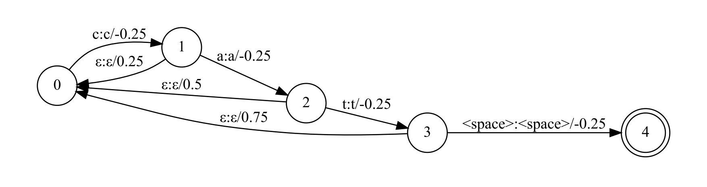

## Context Biasing

In the practical application of ASR, the recognition effect of commonly used words is better, but for some unique words, the recognition accuracy may be low. Contextual biasing is the problem of injecting prior knowledge into an ASR system during inference, for example a user’s favorite songs, contacts, apps or location. Conventional ASR systems perform contextual biasing by building an n-gram finite state transducer (FST) from a list of biasing phrases, which is composed on-the-fly with the decoder graph during decoding. This helps to bias the recognition result towards the n-grams contained in the contextual FST, and thus improves accuracy in certain scenarios.

In WeNet, we compute the biasing scores $P_C(\mathbf y)$, which are interpolated with the base model $P(\mathbf y|\mathbf x)$ using shallow-fusion during beam search, including CTC prefix beam search and CTC WFST beam search.

$$
\mathbf y^*=\mathrm{arg\,max\,log}P(\mathbf y|\mathbf x)+\lambda\,\mathrm{log}\,P_C(\mathbf y)
$$

where, $\lambda$ is a tunable hyperparameter controlling how much the contextual LM influences the overall model score during beam search.

### Context Graph

If we want to improve the score of the word "cat", and the biasing score $\lambda\,\mathrm{log}\,P_C(\mathbf y)$ of each character is 0.25. The context graph can be constructed as follow:



In the decoding process, when the corresponding prefix is matched, the corresponding score reward will be obtained. In order to avoid artificially boosting prefixes which match early on but do not match the entire phrase, we add a special failure arc which removes the boosted score.

WeNet records only one state for each prefix, to easily determine the boundary of the matched hot word. That is, only one hot word can be matched at the same time, and only after the hot word matching succeeds or fails can other hot words start matching.

``` c++
int ContextGraph::GetNextState(int cur_state, int word_id, float* score,
                               bool* is_start_boundary, bool* is_end_boundary) {
  int next_state = 0;
  // Traverse the arcs of current state.
  for (fst::ArcIterator<fst::StdFst> aiter(*graph_, cur_state); !aiter.Done();
       aiter.Next()) {
    const fst::StdArc& arc = aiter.Value();
    if (arc.ilabel == 0) {
      // Record the score of the backoff arc. It might will be covered.
      *score = arc.weight.Value();
    } else if (arc.ilabel == word_id) {
      // If they match, record the next state and the score.
      next_state = arc.nextstate;
      *score = arc.weight.Value();
      // Check whether is the boundary of the hot word.
      if (cur_state == 0) {
        *is_start_boundary = true;
      }
      if (graph_->Final(arc.nextstate) == fst::StdArc::Weight::One()) {
        *is_end_boundary = true;
      }
      break;
    }
  }
  return next_state;
}
```

### CTC Prefix Beam Search

In the process of CTC prefix beam search, each prefix needs to record the hot word matching information. After appending the current output character, if the prefix changes, call the above function `GetNextState` to update the state and score of the hot word. If it is the start or end of a hot word, it is also necessary to record the position, which are used to insert the start tag and end tag in the result, such as: "The \<context>cat\</context> is in the bag".

### CTC WFST Beam Search

WeNet adopts the Lattice Faster Online Decoder from Kaldi for WFST beam search. We have to modify the `lattice-faster-decoder.cc` to support context biasing.

WFST beam search decodes in the TLG graph according to the CTC outputs. If we bias the input label of the TLG, we need to compose the context graph with the Token graph. Finally, we decide to bias TLG's output towards the contextual fst. We need to modify the `ProcessEmitting` and `ProcessNonemitting` functions as follow:

```c++
Elem *e_next =
    FindOrAddToken(arc.nextstate, frame + 1, tot_cost, tok, NULL);
// NULL: no change indicator needed

// ========== Context code BEGIN ===========
bool is_start_boundary = false;
bool is_end_boundary = false;
float context_score = 0;
if (context_graph_) {
  if (arc.olabel == 0) {
    e_next->val->context_state = tok->context_state;
  } else {
    e_next->val->context_state = context_graph_->GetNextState(
      tok->context_state, arc.olabel, &context_score,
      &is_start_boundary, &is_end_boundary);
    graph_cost -= context_score;
  }
}
// ========== Context code END ==========

// Add ForwardLink from tok to next_tok (put on head of list
// tok->links)
tok->links = new ForwardLinkT(e_next->val, arc.ilabel, arc.olabel,
                              graph_cost, ac_cost, is_start_boundary,
                              is_end_boundary, tok->links);
tok->links->context_score = context_score;
```

### Pruning

The backoff arc will return the accumulated scores to a single ForwardLink. It leads to the cost of that ForwardLink is too large. We have to remove the cost returned by backoff arc before pruning.

```c++
void LatticeFasterDecoderTpl<FST, Token>::PruneForwardLinks(
    int32 frame_plus_one, bool *extra_costs_changed, bool *links_pruned,
    BaseFloat delta) {
  ...
  BaseFloat link_extra_cost =
            next_tok->extra_cost +
            ((tok->tot_cost + link->acoustic_cost + link->graph_cost) -
             next_tok->tot_cost);  // difference in brackets is >= 0
  // ========== Context code BEGIN ===========
  // graph_cost contains the score of hot word
  // link->context_score < 0 means the hot word of the link is returned from backoff arc
  if (link->context_score < 0) {
    link_extra_cost += link->context_score;
  }
  // ========== Context code END ==========
  // link_exta_cost is the difference in score between the best paths
  // through link source state and through link destination state
```

### Usage

1. Specify the `--context_path` to a text file.
   - Each line of the file contains a context.
   - Each context can be split into words with the symbol_table of the ASR model (It means there is no oov in the context).
2. Specify the `--context_score`, the reward of each word in the context.

```bash
cd /home/wenet/runtime/server/x86
export GLOG_logtostderr=1
export GLOG_v=2
wav_path=docker_resource/test.wav
context_path=docker_resource/context.txt
model_dir=docker_resource/model
./build/decoder_main \
    --chunk_size -1 \
    --wav_path $wav_path \
    --model_path $model_dir/final.zip \
    --context_path $context_path \
    --context_score 3 \
    --dict_path $model_dir/words.txt 2>&1 | tee log.txt
```


