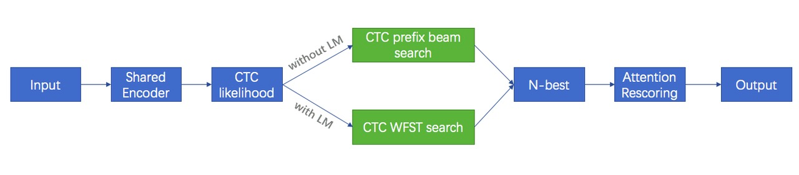

# LM for WeNet

WeNet uses n-gram based statistical language model and the WFST framework to support the custom language model.
And LM is only supported in runtime of WeNet.

## Motivation

Why n-gram based LM? This may be the first question many people will ask.
Now that LM based on RNN and Transformer is in full swing, why does WeNet go backward?
The reason is simple, it is for productivity.
The n-gram-based language model has mature and complete training tools,
any amount of corpus can be trained, the training is very fast, the hotfix is easy,
and it has a wide range of mature applications in actual products.

Why WFST? It may be the second question many people will ask.
Since both industry and research have been working so hard to abandon traditional speech recognition,
especially the complex decoding technology. Why does WeNet back?
The reason is also very simple, it is for productivity.
WFST is a standard and powerful tool in traditional speech recognition.
And based on this solution, we have mature and complete bug fix solutions and product solutions,
such as that we can use the replace function in WFST for class-based personalization such as contact recognition.

Therefore, just like WeNet's design goal "Production first and Production Ready",
LM in WeNet also puts productivity as the first priority.
So it draws on many very productive tools and solutions accumulated in traditional speech recognition.
The difference to traditional speech recognition are:

1. The training in WeNet is pure end to end.
2. As described below, LM is optional in decoding, you can choose whether to use LM according to your needs and application scenarios.


## System Design

The whole system is shown in the bellowing picture. There are two ways to generate N-best.



1. Without LM, we use CTC prefix beam search to generate N-best.
2. With LM, we use CTC WFST search to generate N-best and CTC WFST search is the traditional WFST based decoder.

There are two main parts of the CTC WFST based search.

The first is building the decoding graph, which is to compose the model unit T, the lexicon L and the language model G into one unified graph TLG. And in which:
1. T is the model unit in E2E training. Typically it's char in Chinese, char or BPE in English.
2. L is the lexicon, the lexicon is very simple. What we need to do is just split a word into its modeling unit sequence.
For example, the word "我们" is split into two chars "我 们", and the word "APPLE" is split into five letters "A P P L E".
We can see there is no phonemes and there is no need to design pronunciation on purpose.
3. G is the language model, namely compiling the n-gram to standard WFST representation.

The second is the decoder, which is the same as the traditional decoder, which uses the standard Viterbi beam search algorithm in decoding.

## Implementation

WeNet draws on the decoder and related tools in Kaldi to support LM and WFST based decoding.
For ease of using and keeping independence, we directly migrated the code related to decoding in Kaldi to [this directory](https://github.com/wenet-e2e/wenet/tree/main/runtime/core/kaldi) in WeNet runtime.
And modify and organize according to the following principles:
1. To minimize changes, the migrated code remains the same directory structure as the original.
2. We use GLOG to replace the log system in Kaldi.
3. We modify the code format to meet the lint requirements of the code style in WeNet.

The core code is https://github.com/wenet-e2e/wenet/blob/main/runtime/core/decoder/ctc_wfst_beam_search.cc,
which wraps the LatticeFasterDecoder in Kaldi.
And we use blank frame skipping to speed up decoding.

In addition, WeNet also migrated related tools for building the decoding graph,
such as arpa2fst, fstdeterminizestar, fsttablecompose, fstminimizeencoded, and other tools.
So all the tools related to LM are built-in tools and can be used out of the box.


## Results

We get consistent gain (3%~10%) on different datasets,
including aishell, aishell2, and librispeech,
please go to the corresponding example dataset for the details.

## How to use?

Here is an example from aishell, which shows how to prepare the dictionary, how to train the LM,
how to build the graph, and how to decode with the runtime.

``` sh
# 7.1 Prepare dict
unit_file=$dict
mkdir -p data/local/dict
cp $unit_file data/local/dict/units.txt
tools/fst/prepare_dict.py $unit_file ${data}/resource_aishell/lexicon.txt \
    data/local/dict/lexicon.txt
# 7.2 Train lm
lm=data/local/lm
mkdir -p $lm
tools/filter_scp.pl data/train/text \
     $data/data_aishell/transcript/aishell_transcript_v0.8.txt > $lm/text
local/aishell_train_lms.sh
# 7.3 Build decoding TLG
tools/fst/compile_lexicon_token_fst.sh \
    data/local/dict data/local/tmp data/local/lang
tools/fst/make_tlg.sh data/local/lm data/local/lang data/lang_test || exit 1;
# 7.4 Decoding with runtime
./tools/decode.sh --nj 16 \
    --beam 15.0 --lattice_beam 7.5 --max_active 7000 \
    --blank_skip_thresh 0.98 --ctc_weight 0.5 --rescoring_weight 1.0 \
    --fst_path data/lang_test/TLG.fst \
    --dict_path data/lang_test/words.txt \
    data/test/wav.scp data/test/text $dir/final.zip \
    data/lang_test/units.txt $dir/lm_with_runtime
```
