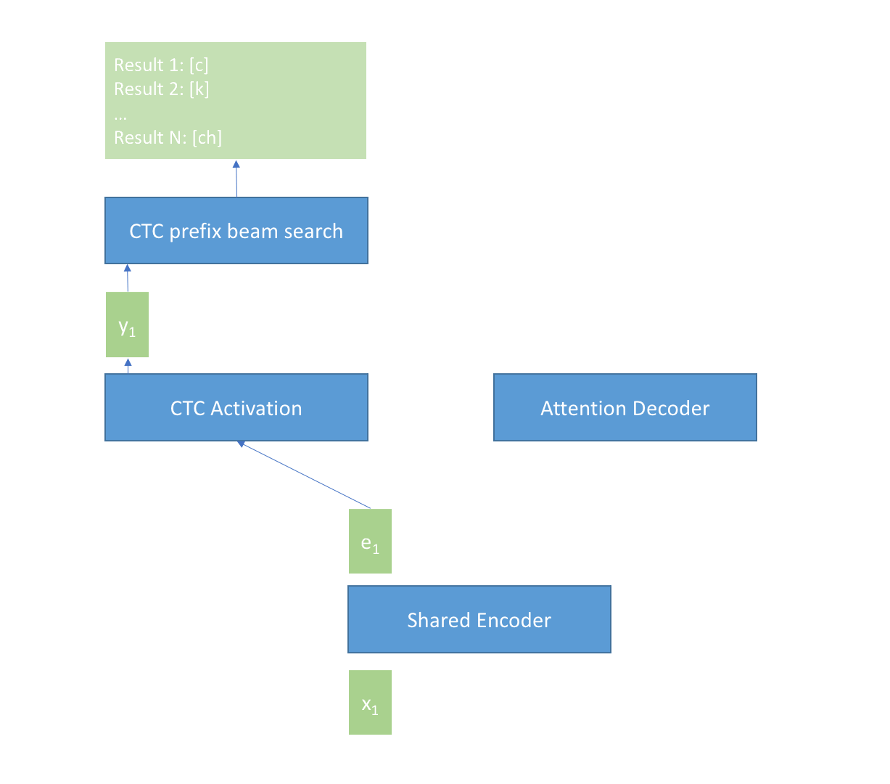
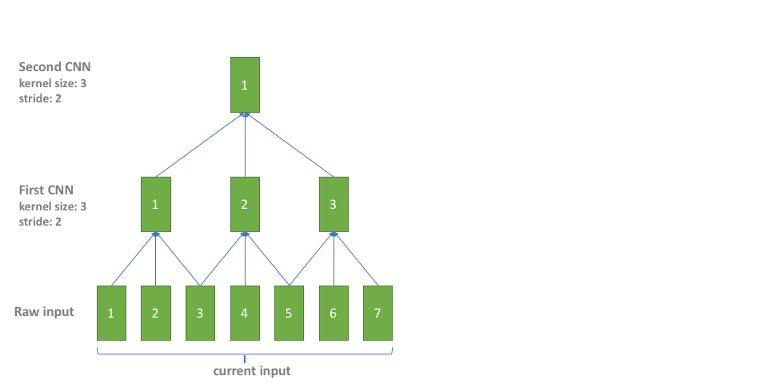

# Runtime for WeNet

WeNet runtime uses [Unified Two Pass (U2)](https://arxiv.org/pdf/2012.05481.pdf) framework for inference. U2 has the following advantages:
* **Unified**: U2 unified the streaming and non-streaming model in a simple way, and our runtime is also unified. Therefore you can easily balance the latency and accuracy by changing chunk_size (described in the following section).
* **Accurate**: U2 achieves better accuracy by CTC joint training.
* **Fast**: Our runtime uses attention rescoring based decoding method described in U2, which is much faster than a traditional autoregressive beam search.
* **Other benefits**: In practice, we find U2 is more stable on long-form speech than standard transformer which usually fails or degrades a lot on long-form speech; and we can easily get the word-level time stamps by CTC spikes in U2. Both of these aspects are favored for industry adoption.

## Platforms Supported

The WeNet runtime supports the following platforms.

* Server
  * [x86](https://github.com/wenet-e2e/wenet/tree/main/runtime/server/x86)
* Device
  * [android](https://github.com/wenet-e2e/wenet/tree/main/runtime/device/android/wenet)

## Architecture and Implementation

### Architecture

The following picture shows how U2 works.

When input is not finished, the input frames $x_t$ are fed into the *Shared Encoder* module frame by frame to get the encoder output $e_t$, then $e_t$ is transformed by the *CTC Activation* module (typically, it's just a linear transform with a log_softmax) to get the CTC prob $y_t$ at current frame, and $y_t$ is further used by the *CTC prefix beam search* module to generate n-best results at current time $t$, and the best result is used as partial result of the U2 system.

When input is finished at time $T$, the n-best results from the *CTC prefix beam search* module and the encoder output $e_1, e_2, e_3, ..., e_T$ are fed into the *Attention Decoder* module, then the *Attention Decoder* module computes a score for every result. The result with the best score is selected as the final result of U2 system.

We can group $C$ continuous frames $x_t, x_{t+1}, x_{t+C}$ as one chunk for the *Shared Encoder* module, and $C$ is called chunk_size in the U2 framework. The chunk_size will affect the attention computation in the *Shared Encoder* module. When chunk_size is infinite, it is a non-streaming case. The system gives the best accuracy with infinite latency. When chunk_size is limited (typically less than 1s), it is a streaming case. The system has limited latency and also gives promising accuracy. So the developer can balance the accuracy and latency and setting a proper chunk_size.

### Interface Design

We use LibTorch to implement U2 runtime in WeNet, and we export several interfaces in PyTorch python code by @torch.jit.export (see [asr_model.py](https://github.com/wenet-e2e/wenet/tree/main/wenet/transformer/asr_model.py)), which are required and used in C++ runtime in [torch_asr_model.cc](https://github.com/wenet-e2e/wenet/tree/main/runtime/server/x86/decoder/torch_asr_model.cc) and [torch_asr_decoder.cc](https://github.com/wenet-e2e/wenet/tree/main/runtime/server/x86/decoder/torch_asr_decoder.cc). Here we just list the interface and give a brief introduction.

| interface                        | description                             |
|----------------------------------|-----------------------------------------|
| subsampling_rate (args)          | get the subsampling rate of the model   |
| right_context (args)             | get the right context of the model      |
| sos_symbol (args)                | get the sos symbol id of the model      |
| eos_symbol (args)                | get the eos symbol id of the model      |
| forward_encoder_chunk (args)     | used for the *Shared Encoder* module    |
| ctc_activation (args)            | used for the *CTC Activation* module    |
| forward_attention_decoder (args) | used for the *Attention Decoder* module |

### Cache in Details

For streaming scenario, the *Shared Encoder* module works in an incremental way. The current chunk computation requries the inputs and outputs of all the history chunks. We implement the incremental computation by using caches. Overall, three caches are used in our runtime.

* Encoder Conformer/Transformer layers output cache: cache the output of every encoder layer.
* Conformer CNN cache: if conformer is used, we should cache the left context for causal CNN computation in Conformer.
* Subsampling cache: cache the output of subsampling layer, which is the input of the first encoder layer.

Please see [encoder.py:forward_chunk()](https://github.com/wenet-e2e/wenet/tree/main/wenet/transformer/encoder.py) and [torch_asr_decoder.cc](https://github.com/wenet-e2e/wenet/tree/main/runtime/server/x86/decoder/torch_asr_decoder.cc) for details of the caches.

In practice, CNN is also used in the subsampling. We should handle the CNN cache in subsampling. However, since there are serveral CNN layers in subsampling with different left contexts, right contexts and strides, which makes it tircky to directly implement the CNN cache in subsampling. In our implementation, we simply overlap the input to avoid subsampling CNN cache. It is simple and straightforward with negligible additional cost since subsampling CNN only costs a very small fraction of the whole computation. The following picture shows how it works, where the blue color is for the overlap part of current inputs and previous inputs.

## References
1. [Sequence Modeling With CTC](https://distill.pub/2017/ctc/)
2. [First-Pass Large Vocabulary Continuous Speech Recognition using Bi-Directional Recurrent DNNs](https://arxiv.org/pdf/1408.2873.pdf)
3. [Unified Streaming and Non-streaming Two-pass End-to-end Model for Speech Recognition](https://arxiv.org/pdf/2012.05481.pdf)
