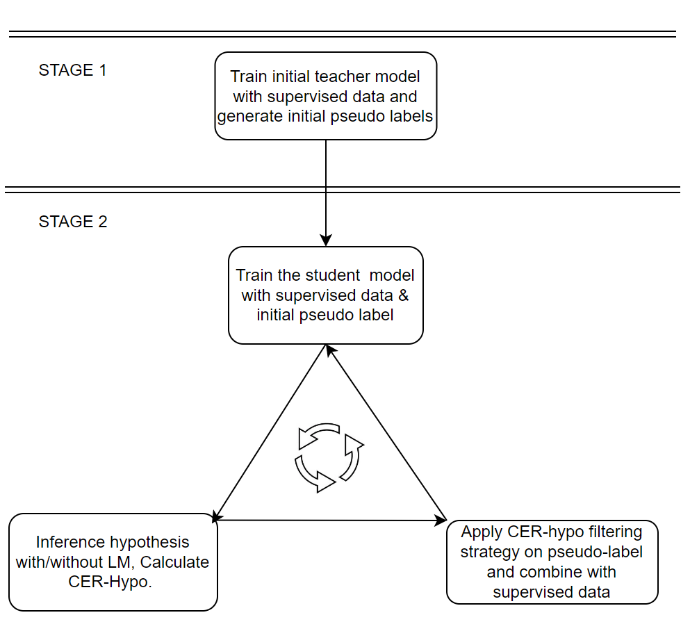

# Recipe to run Noisy Student Training with LM filter in WeNet

Noisy Student Training (NST) has recently demonstrated extremely strong performance in Automatic Speech Recognition (ASR).

Here, we provide a recipe to run NST with `LM filter` strategy using AISHELL-1 as supervised data and WenetSpeech as unsupervised data from [this paper](https://arxiv.org/abs/2211.04717), where hypotheses with and without Language Model are generated and CER differences between them are utilized as a filter threshold to improve the ASR performances of non-target domain datas.

## Table of Contents

- [Guideline](#guideline)
  - [Data preparation](#data-preparation)
  - [Initial supervised teacher](#initial-supervised-teacher)
  - [Noisy student interations](#noisy-student-interations)
- [Performance Record](#performance-record)
  - [Supervised baseline and standard NST](##supervised-baseline-and-standard-nst)
  - [Supervised AISHELL-1 and unsupervised 1khr WenetSpeech](#supervised-aishell-1-and-unsupervised-1khr-wenetspeech)
  - [Supervised AISHELL-2 and unsupervised 4khr WenetSpeech](#supervised-aishell-2-and-unsupervised-4khr-wenetspeech)
- [Citations](#citations)

## Guideline


First, you have to prepare supervised and unsupervised data for NST. Then in stage 1 of `run.sh`, you will train an initial supervised teacher and generate pseudo labels for unsupervised data.
After that, you can run the noisy student training iteratively in stage 2. The whole pipeline is illustrated in the following picture.



### Data preparation

To run this recipe, you should follow the steps from [WeNet examples](https://github.com/wenet-e2e/wenet/tree/main/examples) to prepare [AISHELL1](https://github.com/wenet-e2e/wenet/tree/main/examples/aishell/s0) and [WenetSpeech](https://github.com/wenet-e2e/wenet/tree/main/examples/wenetspeech/s0) data.
We extract 1khr data from WenetSpeech and data should be prepared and stored in the following format:

```
data/
├── train/
├──── data_aishell.list
├──── wenet_1khr.list
├──── wav_dir/
├──── utter_time.json (optional)
├── dev/
└── test/

```
- Files `*.list` contain paths for all the data shards for training.
- A Json file containing the audio length should be prepared as `utter_time.json` if you want to apply the `speaking rate` filter.
- A wav_dir contains all the audio data (id.wav) and labels (id.txt which is optional) for unsupervised data.

### Initial supervised teacher

To train an initial supervised teacher model, run the following command:

```bash
bash run.sh --stage 1 --stop-stage 1
```

Full arguments are listed below, you can check `run.sh` and `run_nst.sh` for more information about steps in each stage and their arguments. We used `num_split = 60` and generate shards with different cpu for the experiments in our paper which saved us lots of inference time and data shards generation time.

```bash
bash run.sh --stage 1 --stop-stage 1 --dir exp/conformer_test_fully_supervised --supervised_data_list data_aishell.list --enable_nst 0 --num_split 1 --unsupervised_data_list wenet_1khr.list --dir_split wenet_split_60_test/ --job_num 0 --hypo_name hypothesis_nst0.txt --label 1 --wav_dir data/train/wenet_1k_untar/ --cer_hypo_dir wenet_cer_hypo --cer_label_dir wenet_cer_label --label_file label.txt --cer_hypo_threshold 10 --speak_rate_threshold 0 --utter_time_file utter_time.json --untar_dir data/train/wenet_1khr_untar/ --tar_dir data/train/wenet_1khr_tar/ --out_data_list data/train/wenet_1khr.list
```
- `dir` contains the training parameters.
- `data_list` contains paths for the training data list.
- `supervised_data_list` contains paths for supervised data shards.
- `unsupervised_data_list`contains paths for unsupervised data shards which is used for inference.
- `dir_split` is the directory stores split unsupervised data for parallel computing.
- `out_data_list` is the pseudo label data list file path.
- `enable_nst` indicates whether we train with pseudo label and split data, for initial teacher we set it to 0.
- This recipe uses the default `num_split=1` while we strongly recommend use larger number to decrease the inference and shards generation time.
> **HINTS** If num_split is set to N larger than 1, you need to modify the script in step 4-8 in run_nst.sh to submit N tasks into your own clusters (such as slurm,ngc etc..).
> We strongly recommend to do so since inference and pseudo-data generation is time-consuming.

### Noisy student interations

After finishing the initial fully supervised baseline, we now have the mixed list contains both supervised and pseudo data which is `wenet_1khr_nst0.list`.
We will use it as the `data_list` in the training step and the `data_list` for next NST iteration will be generated.

Here is an example command:

```bash
bash run.sh --stage 2 --stop-stage 2 --iter_num 2
```

Here we add extra argument `iter_num` for number of NST iterations. Intermediate files are named with `iter_num` as a suffix.
Please check the `run.sh` and `run_nst.sh` scripts for more information about each stage and their arguments.

## Performance Record

### Supervised baseline and standard NST
* Non-streaming conformer model with attention rescoring decoder.
* Without filter strategy, first iteration
* Feature info: using FBANK feature, dither, cmvn, online speed perturb
* Training info: lr 0.002, batch size 32, 8 gpu, acc_grad 4, 240 epochs, dither 0.1
* Decoding info: ctc_weight 0.3, average_num 30


| Supervised               | Unsupervised | Test CER |
|--------------------------|--------------|----------|
| AISHELL-1 Only           | ----         | 4.85     |
| AISHELL-1+WenetSpeech    | ----         | 3.54     |
| AISHELL-1+AISHELL-2      | ----         | 1.01     |
| AISHELL-1 (standard NST) | WenetSpeech  | 5.52     |


### Supervised AISHELL-1 and unsupervised 1khr WenetSpeech
* Non-streaming conformer model with attention rescoring decoder.
* Feature info: using FBANK feature
* Training info: lr=0.002, batch_size=32, 8 GPUs, acc_grad=4, 120 epochs, dither=0.1
* Decoding info: ctc_weight=0.3, average_num=30, pseudo_ratio=0.75

| # nst iteration | AISHELL-1 test CER | Pseudo CER| Filtered CER | Filtered hours |
|----------------|--------------------|-----------|--------------|----------------|
| 0 | 4.85             | 47.10     |   25.18           |     323           |
| 1 | 4.86             | 37.02     |   20.93           |     436           |
| 2 | 4.75             | 31.81     |   19.74           |     540           |
| 3 | 4.69             | 28.27     |   17.85           |     592           |
| 4 | 4.48             | 26.64     |   14.76           |     588           |
| 5 | 4.41             | 24.70     |   15.86           |     670           |
| 6 | 4.34             | 23.64     |   15.40           |     669           |
| 7 | 4.31             | 23.79     |   15.75           |     694           |

### Supervised AISHELL-2 and unsupervised 4khr WenetSpeech
* Non-streaming conformer model with attention rescoring decoder.
* Feature info: using FBANK feature
* Training info: lr=0.002, batch_size=32, 8 GPUs, acc_grad=4, 120 epochs, dither=0.1
* Decoding info: ctc_weight=0.3, average_num=30, pseudo_ratio=0.75

| # nst iteration | AISHELL-2 test CER | Pseudo CER | Filtered CER | Filtered hours |
|----------------|--------------------|------------|--------------|----------------|
| 0 | 5.48               | 30.10      | 11.73        | 1637           |
| 1 | 5.09               | 28.31      | 9.39         | 2016           |
| 2 | 4.88               | 25.38      | 9.99         | 2186           |
| 3 | 4.74               | 22.47      | 10.66        | 2528           |
| 4 | 4.73               | 22.23      | 10.43        | 2734           |


## Citations

``` bibtex

@article{chen2022NST,
  title={Improving Noisy Student Training on Non-target Domain Data for Automatic Speech Recognition},
  author={Chen, Yu and Wen, Ding and Lai, Junjie},
  journal={arXiv preprint arXiv:2203.15455},
  year={2022}
}
