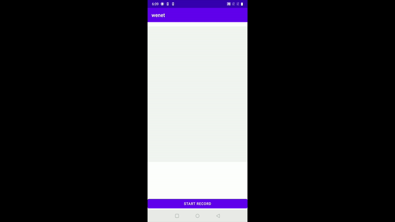

# WeNet On-device ASR Android Demo

This Android demo shows we can run on-device streaming ASR with WeNet. You can download our prebuilt APK or build your APK from source code.

## Prebuilt APK

* [Chinese ASR Demo APK, with model trained on AIShell data](http://mobvoi-speech-public.ufile.ucloud.cn/public/wenet/aishell/20210202_app.apk)
* [English ASR Demo APK, with model trained on LibriSpeech data (To be added)]()

## Build your APK from source code

### 1) Build model

You can use our pretrained model (click the following link to download):

* [Chinese model trained on AIshell](http://mobvoi-speech-public.ufile.ucloud.cn/public/wenet/aishell/20210601_unified_transformer_device.tar.gz)
* [Model trained on AISHELL-2](http://mobvoi-speech-public.ufile.ucloud.cn/public/wenet/aishell2/20210602_unified_transformer_device.tar.gz)
* [English model trained on LibriSpeech(TODO)]()

Or you can train your own model using WeNet training pipeline on your data.

### 2) Build APK

When your model is ready, put `final.zip` and `words.txt` into Android assets (`app/src/main/assets`) folder,
then just build and run the APK. Here is a gif demo, which shows how our on-device streaming e2e ASR runs with low latency.
Please note the wifi and data has been disabled in the demo so there is no network connection ^\_^.



## Compute the RTF

Step 1, connect your Android phone, and use `adb push` command to push your model, wav scp, and waves to the sdcard.

Step 2, build the binary and the APK with Android Studio directly, or with the commands as follows:

``` sh
cd runtime/device/android/wenet
./gradlew build
```

Step 3, push your binary and the dynamic library to `/data/local/tmp` as follows:

``` sh
adb push app/.cxx/cmake/release/arm64-v8a/decoder_main /data/local/tmp
adb push app/.cxx/cmake/release/arm64-v8a/gflags-build/lib/libgflags.so /data/local/tmp
adb push app/build/pytorch_android-1.6.0.aar/jni/arm64-v8a/* /data/local/tmp
```

Step 4, change to the directory `/data/local/tmp` of your phone, and export the library path by:

``` sh
adb shell
cd /data/local/tmp
export LD_LIBRARY_PATH=$LD_LIBRARY_PATH:.
```

Step 5, execute the same command as the [x86 demo](../../../server/x86) to run the binary to decode and compute the RTF.
