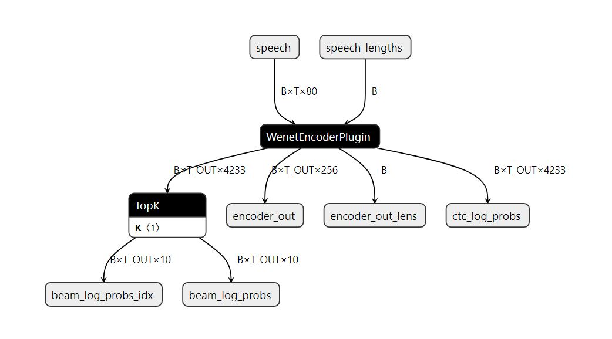
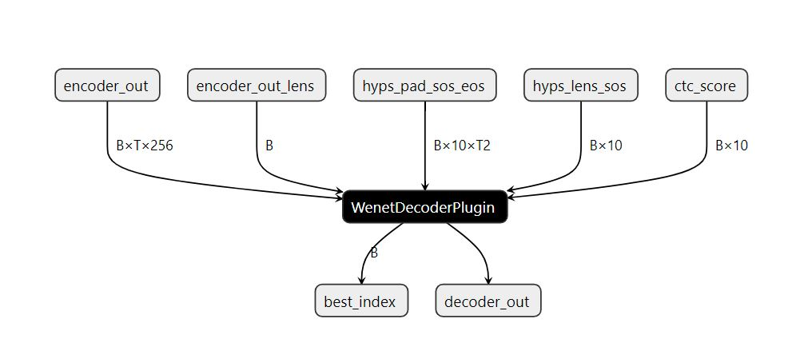

## Recipe for use of FasterTransformer accelerated Conformer model with Triton

```sh
# using docker image runtime/gpu/Dockerfile/Dockerfile.server
docker pull soar97/triton-wenet:22.12
docker run -it --rm --name "wenet_trt_test" --gpus all --net host --shm-size=1g soar97/triton-wenet:22.12
# inside the docker container
git clone https://github.com/wenet-e2e/wenet.git
cd wenet/runtime/gpu/tensorrt_fastertransformer
git submodule update --init
pip3 install nvidia-pyindex
# Use pip3 install -r requirements.txt -i https://pypi.tuna.tsinghua.edu.cn/simple if you encounter network issue
pip3 install -r requirements.txt
# Please modify the model parameters in run.sh. This recipe is for small conformer model.
bash run.sh
```
With help of FasterTransformer wenet tensorrt plugins, the overall throughput could get ~50% improvement comparing with onnx fp16 inference.

<p float="left">
  
  
</p>

#### Performance of Small Model for AIShell2

The following benchmakr shows the performance on T4 of a small Conformer model for AIShell2 case as defined in [WeNet AIShell2 Example](https://github.com/wenet-e2e/wenet/tree/main/examples/aishell2/s0).

<table>
 <col span='11'>
 <tr id='r0'>
<td>Backend</td>
<td>Precision</td>
<td>Input Length</td>
<td>concurrency</td>
<td>RTF</td>
<td>Throughput(infer/s)</td>
<td>Latency_p50(ms)</td>
<td>Latency_p90(ms)</td>
<td>Latency_p95(ms)</td>
<td>Latency_p99(ms)</td>
<td>Avg latency(ms)</td>
 </tr>
 <tr id='r1'>
<td rowspan='11' class='x21'>ONNX</td>
<td rowspan='11' class='x21'>FP16</td>
<td rowspan='6' class='x21'>5s</td>
<td style='text-align:right;'>10</td>
<td style='text-align:right;'>0.00082224</td>
<td style='text-align:right;'>243.238</td>
<td style='text-align:right;'>40.254</td>
<td style='text-align:right;'>49.884</td>
<td style='text-align:right;'>52.553</td>
<td style='text-align:right;'>57.191</td>
<td style='text-align:right;'>41.067</td>
 </tr>
 <tr id='r2'>
<td style='text-align:right;'>50</td>
<td style='text-align:right;'>0.000775588</td>
<td style='text-align:right;'>257.869</td>
<td style='text-align:right;'>200.534</td>
<td style='text-align:right;'>249.891</td>
<td style='text-align:right;'>263.713</td>
<td style='text-align:right;'>285.763</td>
<td style='text-align:right;'>193.721</td>
 </tr>
 <tr id='r3'>
<td style='text-align:right;'>100</td>
<td style='text-align:right;'>0.000777538</td>
<td style='text-align:right;'>257.222</td>
<td style='text-align:right;'>391.78</td>
<td style='text-align:right;'>479.738</td>
<td style='text-align:right;'>505.176</td>
<td style='text-align:right;'>551.676</td>
<td style='text-align:right;'>387.872</td>
 </tr>
 <tr id='r4'>
<td style='text-align:right;'>200</td>
<td style='text-align:right;'>0.000770553</td>
<td style='text-align:right;'>259.554</td>
<td style='text-align:right;'>757.215</td>
<td style='text-align:right;'>908.135</td>
<td style='text-align:right;'>962.108</td>
<td style='text-align:right;'>1122.423</td>
<td style='text-align:right;'>766.502</td>
 </tr>
 <tr id='r5'>
<td style='text-align:right;'>400</td>
<td style='text-align:right;'>0.000773168</td>
<td style='text-align:right;'>258.676</td>
<td style='text-align:right;'>1549.111</td>
<td style='text-align:right;'>1747.315</td>
<td style='text-align:right;'>1822.979</td>
<td style='text-align:right;'>1965.012</td>
<td style='text-align:right;'>1529.002</td>
 </tr>
 <tr id='r6'>
<td style='text-align:right;'>600</td>
<td style='text-align:right;'>0.000768832</td>
<td style='text-align:right;'>260.135</td>
<td style='text-align:right;'>2268.471</td>
<td style='text-align:right;'>2513.159</td>
<td style='text-align:right;'>2584.864</td>
<td style='text-align:right;'>2867.763</td>
<td style='text-align:right;'>2260.872</td>
 </tr>
 <tr id='r7'>
<td rowspan='5' class='x21'>8s</td>
<td style='text-align:right;'>10</td>
<td style='text-align:right;'>0.000749239</td>
<td style='text-align:right;'>166.836</td>
<td style='text-align:right;'>58.89</td>
<td style='text-align:right;'>76.627</td>
<td style='text-align:right;'>80.612</td>
<td style='text-align:right;'>87.494</td>
<td style='text-align:right;'>59.893</td>
 </tr>
 <tr id='r8'>
<td style='text-align:right;'>50</td>
<td style='text-align:right;'>0.000739693</td>
<td style='text-align:right;'>168.989</td>
<td style='text-align:right;'>307.598</td>
<td style='text-align:right;'>380.47</td>
<td style='text-align:right;'>398.13</td>
<td style='text-align:right;'>431.647</td>
<td style='text-align:right;'>295.728</td>
 </tr>
 <tr id='r9'>
<td style='text-align:right;'>100</td>
<td style='text-align:right;'>0.000740175</td>
<td style='text-align:right;'>168.879</td>
<td style='text-align:right;'>584.401</td>
<td style='text-align:right;'>722.173</td>
<td style='text-align:right;'>759.771</td>
<td style='text-align:right;'>820.324</td>
<td style='text-align:right;'>588.995</td>
 </tr>
 <tr id='r10'>
<td style='text-align:right;'>200</td>
<td style='text-align:right;'>0.000733417</td>
<td style='text-align:right;'>170.435</td>
<td style='text-align:right;'>1136.949</td>
<td style='text-align:right;'>1343.338</td>
<td style='text-align:right;'>1396.169</td>
<td style='text-align:right;'>1526.366</td>
<td style='text-align:right;'>1162.847</td>
 </tr>
 <tr id='r11'>
<td style='text-align:right;'>400</td>
<td style='text-align:right;'>0.000758132</td>
<td style='text-align:right;'>164.879</td>
<td style='text-align:right;'>2424.999</td>
<td style='text-align:right;'>2837.982</td>
<td style='text-align:right;'>2948.57</td>
<td style='text-align:right;'>3165.213</td>
<td style='text-align:right;'>2407.398</td>
 </tr>
 <tr id='r12'>
<td rowspan='12' class='x21'>TensorRT</td>
<td rowspan='12' class='x21'>FP16</td>
<td rowspan='6' class='x21'>5s</td>
<td style='text-align:right;'>10</td>
<td style='text-align:right;'>0.000806917</td>
<td style='text-align:right;'>247.857</td>
<td style='text-align:right;'>40.607</td>
<td style='text-align:right;'>55.071</td>
<td style='text-align:right;'>59.839</td>
<td style='text-align:right;'>70.496</td>
<td style='text-align:right;'>40.292</td>
 </tr>
 <tr id='r13'>
<td style='text-align:right;'>50</td>
<td style='text-align:right;'>0.000616084</td>
<td style='text-align:right;'>324.631</td>
<td style='text-align:right;'>155.034</td>
<td style='text-align:right;'>207.362</td>
<td style='text-align:right;'>224.129</td>
<td style='text-align:right;'>247.152</td>
<td style='text-align:right;'>153.683</td>
 </tr>
 <tr id='r14'>
<td style='text-align:right;'>100</td>
<td style='text-align:right;'>0.000539622</td>
<td style='text-align:right;'>370.63</td>
<td style='text-align:right;'>274.031</td>
<td style='text-align:right;'>319.398</td>
<td style='text-align:right;'>333.757</td>
<td style='text-align:right;'>353.26</td>
<td style='text-align:right;'>269.732</td>
 </tr>
 <tr id='r15'>
<td style='text-align:right;'>200</td>
<td style='text-align:right;'>0.000531885</td>
<td style='text-align:right;'>376.021</td>
<td style='text-align:right;'>515.018</td>
<td style='text-align:right;'>638.437</td>
<td style='text-align:right;'>657.918</td>
<td style='text-align:right;'>680.002</td>
<td style='text-align:right;'>592.341</td>
 </tr>
 <tr id='r16'>
<td style='text-align:right;'>400</td>
<td style='text-align:right;'>0.000536799</td>
<td style='text-align:right;'>372.579</td>
<td style='text-align:right;'>1040.958</td>
<td style='text-align:right;'>1173.062</td>
<td style='text-align:right;'>1187.594</td>
<td style='text-align:right;'>1237.658</td>
<td style='text-align:right;'>1064.299</td>
 </tr>
 <tr id='r17'>
<td style='text-align:right;'>800</td>
<td style='text-align:right;'>0.000561322</td>
<td style='text-align:right;'>356.302</td>
<td style='text-align:right;'>2210.466</td>
<td style='text-align:right;'>2319.285</td>
<td style='text-align:right;'>2343.111</td>
<td style='text-align:right;'>2893.016</td>
<td style='text-align:right;'>2207.461</td>
 </tr>
 <tr id='r18'>
<td rowspan='6' class='x21'>8s</td>
<td style='text-align:right;'>10</td>
<td style='text-align:right;'>0.00066929</td>
<td style='text-align:right;'>186.765</td>
<td style='text-align:right;'>53.462</td>
<td style='text-align:right;'>74.164</td>
<td style='text-align:right;'>81.128</td>
<td style='text-align:right;'>96.467</td>
<td style='text-align:right;'>53.454</td>
 </tr>
 <tr id='r19'>
<td style='text-align:right;'>50</td>
<td style='text-align:right;'>0.000550967</td>
<td style='text-align:right;'>226.874</td>
<td style='text-align:right;'>223.332</td>
<td style='text-align:right;'>282.558</td>
<td style='text-align:right;'>310.565</td>
<td style='text-align:right;'>355.387</td>
<td style='text-align:right;'>219.928</td>
 </tr>
 <tr id='r20'>
<td style='text-align:right;'>100</td>
<td style='text-align:right;'>0.000525813</td>
<td style='text-align:right;'>237.727</td>
<td style='text-align:right;'>423.628</td>
<td style='text-align:right;'>497.259</td>
<td style='text-align:right;'>517.581</td>
<td style='text-align:right;'>563.85</td>
<td style='text-align:right;'>418.962</td>
 </tr>
 <tr id='r21'>
<td style='text-align:right;'>200</td>
<td style='text-align:right;'>0.000513162</td>
<td style='text-align:right;'>243.588</td>
<td style='text-align:right;'>794.689</td>
<td style='text-align:right;'>911.775</td>
<td style='text-align:right;'>973.896</td>
<td style='text-align:right;'>1037.958</td>
<td style='text-align:right;'>815.351</td>
 </tr>
 <tr id='r22'>
<td style='text-align:right;'>400</td>
<td style='text-align:right;'>0.000531747</td>
<td style='text-align:right;'>235.074</td>
<td style='text-align:right;'>1683.981</td>
<td style='text-align:right;'>1823.173</td>
<td style='text-align:right;'>1852.701</td>
<td style='text-align:right;'>1910.553</td>
<td style='text-align:right;'>1685.217</td>
 </tr>
 <tr id='r23'>
<td style='text-align:right;'>600</td>
<td style='text-align:right;'>0.000585379</td>
<td style='text-align:right;'>213.537</td>
<td style='text-align:right;'>2782.118</td>
<td style='text-align:right;'>2939.944</td>
<td style='text-align:right;'>2998.534</td>
<td style='text-align:right;'>3192.138</td>
<td style='text-align:right;'>2751.356</td>
 </tr>
</table>

Note: Currently, encoder only supports offline conformer model. Decoder only supports transformer decoder.

For directly using FasterTransformer built wenet, you may refer to https://github.com/NVIDIA/FasterTransformer/tree/main/examples/cpp/wenet
