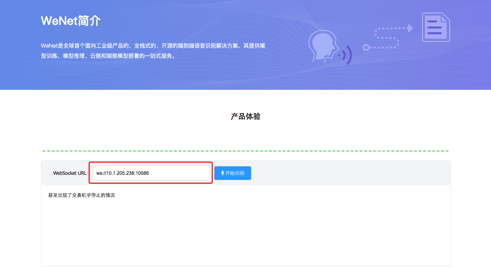
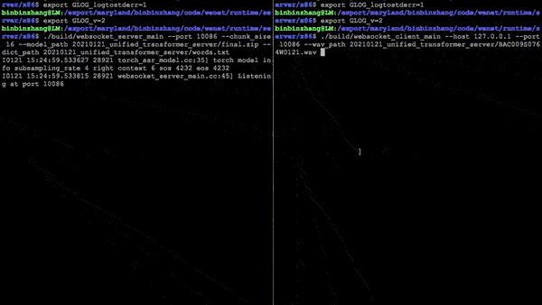

# WeNet Server (x86) ASR Demo

**[中文版:x86 平台上使用 WeNet 进行语音识别](./README_CN.md)**

## Run with Prebuilt Docker

* Step 1. Download pretrained model(see the following link) or prepare your trained model.

[AISHELL-1](https://wenet-1256283475.cos.ap-shanghai.myqcloud.com/models/aishell/20210601_u2%2B%2B_conformer_libtorch.tar.gz)
| [AISHELL-2](https://wenet-1256283475.cos.ap-shanghai.myqcloud.com/models/aishell2/20210618_u2pp_conformer_libtorch.tar.gz)
| [GigaSpeech](https://wenet-1256283475.cos.ap-shanghai.myqcloud.com/models/gigaspeech/20210728_u2pp_conformer_libtorch.tar.gz)
| [LibriSpeech](https://wenet-1256283475.cos.ap-shanghai.myqcloud.com/models/librispeech/20210610_u2pp_conformer_libtorch.tar.gz)
| [Multi-CN](https://wenet-1256283475.cos.ap-shanghai.myqcloud.com/models/multi_cn/20210815_unified_conformer_libtorch.tar.gz)


* Step 2. Start docker websocket server. Here is a demo.

``` sh
model_dir=$PWD/20210602_u2++_conformer_libtorch  # absolute path
docker run --rm -it -p 10086:10086 -v $model_dir:/home/wenet/model wenetorg/wenet-mini:latest bash /home/run.sh
```

* Step 3. Test with web browser. Open runtime/server/x86/web/templates/index.html in the browser directly, input your `WebSocket URL`, it will request some permissions, and start to record to test, as the following graph shows.



## Run in Docker Build

We recommend using the docker environment to build the c++ binary to avoid
system and environment problems.

* Step 1. Build your docker image.

``` sh
cd docker
docker build --no-cache -t wenet:latest .
```

* Step 2. Put all the resources, like model, test wavs into a docker resource dir.

``` sh
mkdir -p docker_resource
cp -r <your_model_dir> docker_resource/model
cp <your_test_wav> docker_resource/test.wav
```

* Step 3. Start docker container.
``` sh
docker run --rm -v $PWD/docker_resource:/home/wenet/runtime/server/x86/docker_resource -it wenet bash
```

* Step 4. Testing in docker container
```
cd /home/wenet/runtime/server/x86
export GLOG_logtostderr=1
export GLOG_v=2
wav_path=docker_resource/test.wav
model_dir=docker_resource/model
./build/decoder_main \
    --chunk_size -1 \
    --wav_path $wav_path \
    --model_path $model_dir/final.zip \
    --dict_path $model_dir/words.txt 2>&1 | tee log.txt
```

Or you can do the WebSocket server/client testing as described in the `WebSocket` section.

## Run with Local Build

* Step 1. Download or prepare your pretrained model.

* Step 2. Build. The build requires cmake 3.14 or above. For building, please first change to `wenet/runtime/server/x86` as your build directory, then type:

``` sh
mkdir build && cd build && cmake .. && cmake --build .
```

* Step 3. Testing, the RTF(real time factor) is shown in the console.

``` sh
export GLOG_logtostderr=1
export GLOG_v=2
wav_path=your_test_wav_path
model_dir=your_model_dir
./build/decoder_main \
    --chunk_size -1 \
    --wav_path $wav_path \
    --model_path $model_dir/final.zip \
    --dict_path $model_dir/words.txt 2>&1 | tee log.txt
```


## Advanced Usage

### WebSocket

* Step 1. Download or prepare your pretrained model.
* Step 2. Build as in `Run with Local Build`
* Step 3. Start WebSocket server.

``` sh
export GLOG_logtostderr=1
export GLOG_v=2
model_dir=your_model_dir
./build/websocket_server_main \
    --port 10086 \
    --chunk_size 16 \
    --model_path $model_dir/final.zip \
    --dict_path $model_dir/words.txt 2>&1 | tee server.log
```
* Step 4. Start WebSocket client.

```sh
export GLOG_logtostderr=1
export GLOG_v=2
wav_path=your_test_wav_path
./build/websocket_client_main \
    --hostname 127.0.0.1 --port 10086 \
    --wav_path $wav_path 2>&1 | tee client.log
```

You can also start WebSocket client by web browser as described before.

Here is a demo for command line based websocket server/client interaction.



### gRPC

Why grpc? You may find your answer in https://grpc.io/.
Please follow the following steps to try gRPC.

* Step 1. Download or prepare your pretrained model.
* Step 2. Build
``` sh
mkdir build && cd build && cmake -DGRPC=ON .. && cmake --build .
```
* Step 3. Start gRPC server

``` sh
export GLOG_logtostderr=1
export GLOG_v=2
model_dir=your_model_dir
./build/grpc_server_main \
    --port 10086 \
    --workers 4 \
    --chunk_size 16 \
    --model_path $model_dir/final.zip \
    --dict_path $model_dir/words.txt 2>&1 | tee server.log
```

* Step 4. Start gRPC client.

```sh
export GLOG_logtostderr=1
export GLOG_v=2
wav_path=your_test_wav_path
./build/grpc_client_main \
    --hostname 127.0.0.1 --port 10086 \
    --wav_path $wav_path 2>&1 | tee client.log
```

