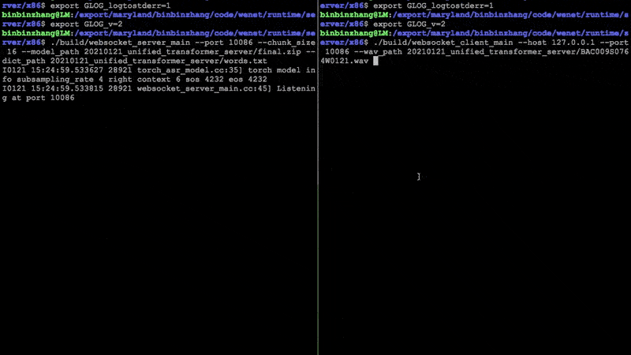

# WeNet Server (x86) ASR Demo

## Build

The build requires cmake 3.14 or above. For building, please first change to `wenet/runtime/server/x86` as your build directory, then type:

``` sh
mkdir build && cd build && cmake .. && cmake --build .
```

## Pretrained model

You can run the following on your trained model, or using our pretrained model. Click the following link to download the pretrained model.

* [Chinese model trained on AIShell](http://mobvoi-speech-public.ufile.ucloud.cn/public/wenet/aishell/20210221_unified_transformer_server.tar.gz)
* [Model trained on AISHELL-2](http://mobvoi-speech-public.ufile.ucloud.cn/public/wenet/aishell2/20210327_unified_transformer_exp_server.tar.gz)
* [TODO: add English model trained on Librispeech](link)

## Run offline ASR demo

You can run the offline demo with the following commands

``` sh
export GLOG_logtostderr=1
export GLOG_v=2
wav_path=your_test_wav_path
model_dir=your_model_dir
./build/decoder_main \
    --chunk_size -1 \
    --wav_path $wav_path \
    --model_path $model_dir/final.zip \
    --dict_path $model_dir/words.txt 2>&1 | tee log.txt
```

After decoding, the average RTF of the waves will display on the console.

## Run Websocket streaming ASR demo

We build a Websocket demo to show how WeNet U2 model works in a streaming fashion.

### Server

First, run the server by:

``` sh
export GLOG_logtostderr=1
export GLOG_v=2
model_dir=your_model_dir
./build/websocket_server_main \
    --port 10086 \
    --chunk_size 16 \
    --model_path $model_dir/final.zip \
    --dict_path $model_dir/words.txt 2>&1 | tee server.log
```

### Web Client

Then, run the web client to communicate with the `websocket_server_main`. There are
two ways to run the web client. Open `web/templates/index.html` in the browser directly, or
start up a web server by Flask as follows:

``` sh
pip install Flask
python web/app.py
```

Input the `WebSocket URL`, it will request some permissions, and start to record.


### Client

Also, you could run the client in the command line by:

```sh
export GLOG_logtostderr=1
export GLOG_v=2
wav_path=your_test_wav_path
./build/websocket_client_main \
    --host 127.0.0.1 --port 10086 \
    --wav_path $wav_path 2>&1 | tee client.log
```

Once finished decoding, compute the average rescoring cost latency by:

``` sh
grep "Rescoring cost latency" server.log | awk '{sum += $NF}; END {print sum/NR}'
```

Moreover, the total latency of decoding `your_test_wav_path` will display on the console.

Here is a gif demo using our pretrained AIShell unified E2E model, which shows how our
model, websocket server and websocket client enable streaming ASR.



## Run the demo in Docker

When you encounter an issue trying to run the demo, we encourage you to run the demo in
the Docker container. The image contains the latest release, a shell script and
several waves to run the demo. Just run it as follows:

``` sh
docker run --rm -it mobvoiwenet/wenet:v0.1.0 bash
```

Or build the Dockerfile yourself, and run it by:

``` sh
DOCKER_BUILDKIT=1 docker build --no-cache -t wenet:latest .
docker run --rm -it wenet bash
cmake --build /home/wenet/runtime/server/x86/build
```

The pretrained model folder is located at `/home`, and the binary is located at `/home/wenet/runtime/server/x86/build`. Run it as previous mentioned.
