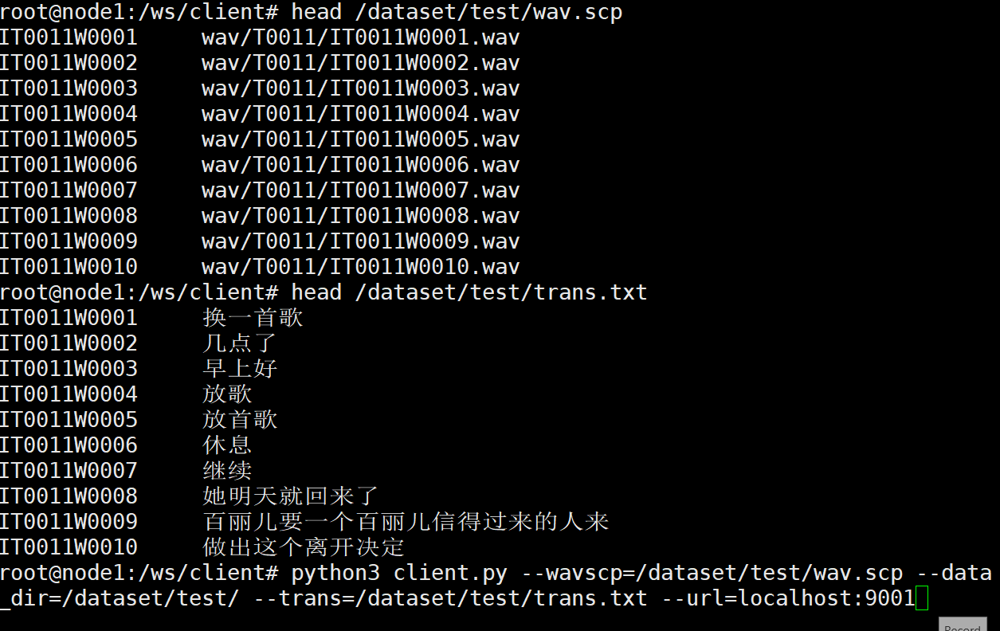

## Introduction
The below example shows how to deploy WeNet offline ASR models on GPUs.


## Instructions
* Step 1. Convert your model/pretrained model to onnx models. For example:
```bash
conda activate wenet
pip install onnxruntime-gpu onnxmltools
cd wenet/examples/wenetspeech && . ./path.sh
model_dir=<absolute path to>/20211025_conformer_exp
onnx_model_dir=<absolute path>
mkdir $onnx_model_dir
python3 wenet/bin/export_onnx_gpu.py --config=$model_dir/train.yaml --checkpoint=$model_dir/final.pt --cmvn_file=$model_dir/global_cmvn --ctc_weight=0.5 --output_onnx_dir=$onnx_model_dir --fp16
cp $model_dir/words.txt $model_dir/train.yaml $onnx_model_dir/
```
Congratulations! You've successully exported the onnx models and now you are able to deploy them. Please also ensure you have set up [NGC](https://catalog.ngc.nvidia.com/) account before the next step!

* Step 2. Build server docker and start server on one gpu:
```
docker build . -f Dockerfile/Dockerfile.server -t wenet_server:latest --network host
docker run --gpus '"device=0"' -it -v $PWD/model_repo:/ws/model_repo -v $onnx_model_dir:/ws/onnx_model -v $model_dir:/ws/model -p 8000:8000 -p 8001:8001 -p 8002:8002 --shm-size=1g --ulimit memlock=-1  wenet_server:latest /workspace/scripts/convert_start_server.sh
```

* Step 3. Start client
```
docker build . -f Dockerfile/Dockerfile.client -t wenet_client:latest --network host

AUDIO_DATA=<path to your wav data>
docker run -ti --net host --name wenet_client -v $PWD/client:/ws/client -v $AUDIO_DATA:/ws/test_data wenet_client:latest
# In docker
cd /ws/client
# test one wav file
python3 client.py --audio_file=/ws/test_data/mid.wav --url=localhost:8001

# test a list of wav files & cer
python3 client.py --wavscp=/ws/dataset/test/wav.scp --data_dir=/ws/dataset/test/ --trans=/ws/dataset/test/text
```



|Model | Dataset | Precision | CER |
|------------|-----------|-----------|----------|
|Aishell2-U2++ Conformer|Aishell2-DEV|FP16| 5.39%|
|Aishell2-U2++ Conformer|Aishell2-DEV|FP32| 5.38%|
|Wenetspeech Conformer| Wenetspeech-DEV|FP16| 8.61%|
|Wenetspeech Conformer| Wenetspeech-DEV|FP32| 8.61%|
|Wenetspeech Conformer | Wenetspeech-TestNet|FP16|9.07%|
|Wenetspeech Conformer| Wenetspeech-TestNet|FP32|9.06%|
|Wenetspeech Concofmer| Wenetspeech-TestMeeting|FP16|15.72%|
|Wenetspeech Conformer| Wenetspeech-TestMeeting|FP32|15.70%|

## Perf Test
We use the below command to do our testing and we run the below command several times to warm up:
```
cd /ws/client
# generate the test data, input to our feature extractor
python3 generate_perf_input.py input.wav input.json
perf_analyzer -m attention_rescoring -b 1 -p 20000 --concurrency-range 100:200:50 -i gRPC --input-data=./input.json  -u localhost:8001
```
Where:
- `input.wav` can be 5 seconds, 8 seconds, 10 seconds audio;
- `-m` option indicates the name of the served model;
- `-p` option is the mearsurement window, which indicates in what time duration to collect the metrics;
- `-v` option turns on the verbose model;
- `-i` option is for choosing the networking protocol, you can choose `HTTP` or `gRPC` here;
- `-u` option sets the url of the service in the form of `<IP Adrress>:<Port>`, but notice that port `8000` corresponds to HTTP protocol while port `8001` corresponds to gRPC protocol;
- `-b` option indicates the batch size of the input requests used fo testing; since we simulate individual users sending requests, we set batch size here to `1`;
- `--input-data` option points to the path of the json file containing the real input data
- `--concurrency-range` option is an important one, it indicates the concurrency of the requests which defines the pressure we will give to the server.
- You can also set `-f` option to set the path of testing result file;
- You can also set `--max-threads` option to set the number of threads used to send test request, it should be set to the number of CPU cores in your test machine.


### Tested ENV
* NVIDIA DRIVER: 470.57.02
* GPU: V100 & T4 & A30
* CUDA: 11.4
* Triton Inference Server: 22.03

### Perf
Here are the wenetspeech conformer model and aishell2 u2++ perf on T4.
* Aishell2, FP16, onnx, [U2++ Conformer](http://mobvoi-speech-public.ufile.ucloud.cn/public/wenet/aishell2/20210618_u2pp_conformer_exp.tar.gz)

|input length|Concurrency|RTF        |Throughput|Latency_p50 (ms)|Latency_p90 (ms)|Latency_p95 (ms)|Latency_p99 (ms)|
|------------|-----------|-----------|----------|----------------|----------------|----------------|----------------|
|5s          | 50        |0.000980633|203.95    |245.003         |277.086         |284.818         |295.777         |
|5s          | 100       |0.000889284|224.9     | 452.578        |492.355         |506.399         |533.325         |
|5s          | 150       |0.000876808|  228.1   |657.478         |722.427         |747.493         |794.346         |
|5s          |200        |0.000878928|  227.55  |875.721         |946.02          |975.703         |1020.615        |
|10s         |10         |0.00114    |  87.9    |116.203         |113.929         |136.902         |149.18          |
|10s         |50         |0.000925926|108       |476.678         |522.65          |532.693         |562.097         |
|10s         |100        |0.000905797|110.4     |921.383         |1001.848        |1029.96         |1067.6          |

* Wenetspeech, FP16, onnx, [Conformer](http://mobvoi-speech-public.ufile.ucloud.cn/public/wenet/wenetspeech/20211025_conformer_exp.tar.gz)

|input length|Concurrency|RTF        |Throughput|Latency_p50 (ms)|Latency_p90 (ms)|Latency_p95 (ms)|Latency_p99 (ms)|
|------------|-----------|-----------|----------|----------------|----------------|----------------|----------------|
|5s          |50         |0.001814059|110.25    |464.18          |508.246         |517.967         |547.002         |
|5s          |100        |0.001780944|112.3     |891.173         |958.046         |1011.058        |1093.231        |
|10s         |5          |0.00201    |49.75     |100.35          |120.757         |122.148         |132.053         |
|10s         |10         |0.002      |49.9      |201.551         |240.75          |252.026         |286.132         |
|10s         |50         |0.001923077|52        |986.52          |1030.635        |1051.282        |1101.016        |

### Others
* Add language model: set `--lm_path` in the `convert_start_server.sh`. Notice the path of your language model is the path in docker.
* You may refer to `wenet/bin/recognize_onnx.py` to run inference locally.
* The model_repo's overview:


### Warning
* We only tested mandarin models in `wenetspeech` and `aishell2` and haven't tested models built with English corpus.
* The bpe models currently are not supported.
* You need to add a VAD module to split your long audio into segments.
* Please pad your audio in order to leverage triton inference [dynamic batching](https://github.com/triton-inference-server/server/blob/main/docs/architecture.md#models-and-schedulers) feature. We suggest you to pad your audio to nearest length such as 2s, 5s, 10s seconds.
* We're still working on improving this solution. If you find any issue, please raise an issue.

## Reference
* [Triton inference server](https://github.com/triton-inference-server/server) & [Client](https://github.com/triton-inference-server/client)

## Acknowledge
This part originates from NVIDIA CISI project. We also have TTS and NLP solutions deployed on triton inference server.
If you are interested, please contact us.

Thanks to @RiverLiu and @day9011 for great effort in testing.